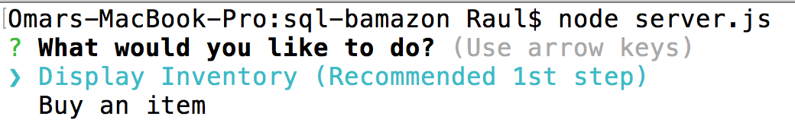
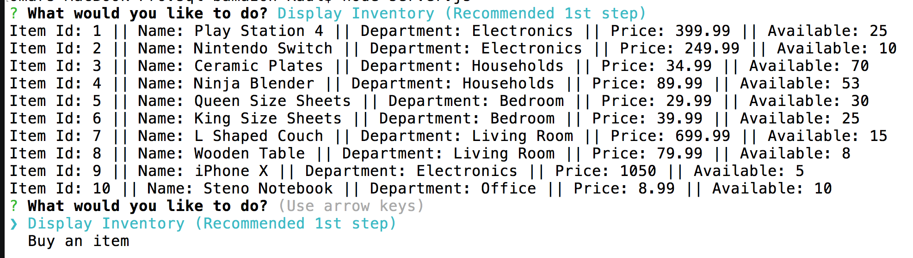
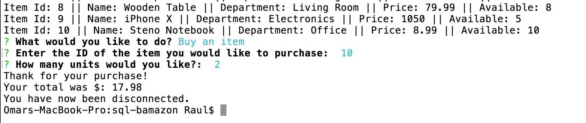
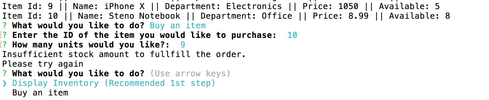

-----------------------------------------
# BAMAZON STOREFRONT
#### Homework on SQL

-----------------------------------------

## Functions

#### List Inventory

Lists the database's contents on the terminal

#### Buy Products from Database

User is able to make a purchase based on **availability** of the database.

If there's no enough stock available, the program won't let the user buy his/her product.

Upon **purchase** the database will update with new values taken away from the purchase.

##Screenshots

###Main Menu

###Display inventory

###Buying an item
#### Notice the item Id 10 is being used and will update on next Screenshot
#### Total of purchase is also displayed on result.

 

###Ordering out of stock
####Previous stock was reduced to 8, and new purchase exceeds inventory, therefore cannot complete purchase.

